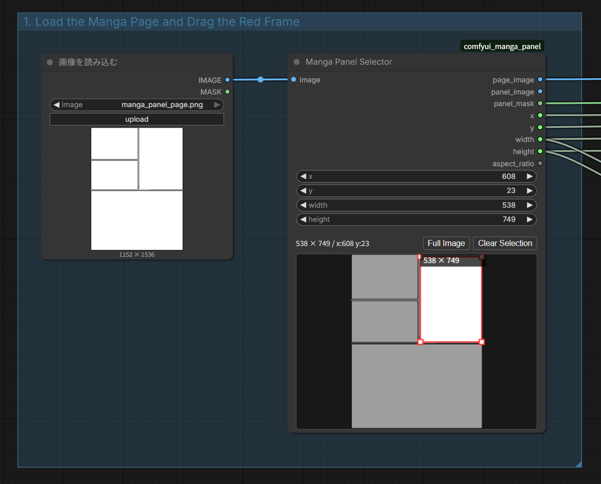
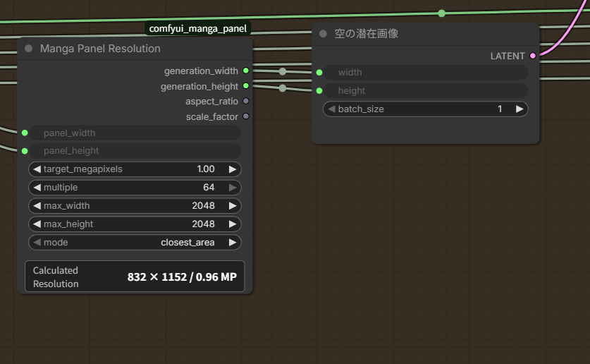
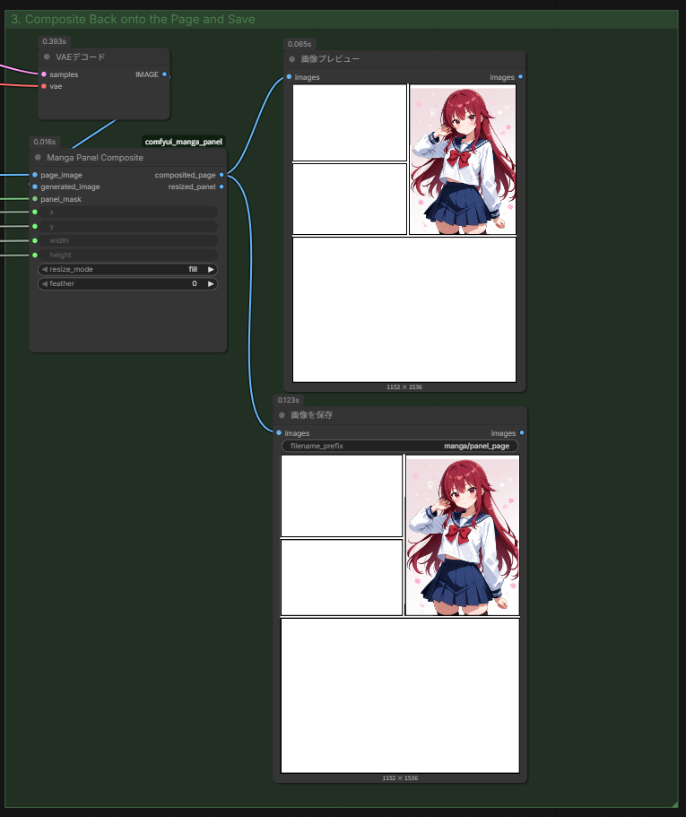

# ComfyUI Manga Panel

English | [日本語](README_JA.md)

GitHub-ready ComfyUI custom nodes for selecting a rectangular manga panel, calculating a generation resolution that preserves its aspect ratio, and compositing the generated image back onto the page. The nodes run locally and do not make external API requests.

## Installation

Clone this repository into `ComfyUI/custom_nodes/comfyui_manga_panel`, then restart ComfyUI.

```powershell
cd ComfyUI\custom_nodes
git clone https://github.com/Tsubasa109/comfyui_manga_panel.git
```

The package registers three nodes under `image/manga`:

- `Manga Panel Selector`
- `Manga Panel Resolution`
- `Manga Panel Composite`

## Nodes

### Manga Panel Selector

Receives a page image from `Load Image` and lets you select a panel with a red rectangle.

- Drag an empty area to create a new selection.
- Drag inside the selection to move it.
- Drag a white corner handle to resize it.
- `Full Image` selects the entire page.
- `Clear Selection` clears the selected coordinates.

When connected directly to the standard `Load Image` node, the selected input image appears before execution. When connected to another image node, queue the workflow once to display its result in the selector.

Outputs include the page image, cropped panel, page-sized mask, coordinates, dimensions, and aspect ratio.



### Manga Panel Resolution

Calculates a model-friendly generation resolution while preserving the selected panel's aspect ratio.

- `target_megapixels`: target pixel count; the default is 1.0 MP.
- `multiple`: unit used to round the generated dimensions.
- `max_width` / `max_height`: maximum generated dimensions.
- `closest_area`: chooses dimensions closest to the target pixel count.
- `fit_within_bounds`: keeps the result within the specified limits.

Connect `generation_width` and `generation_height` to `Empty Latent Image` or another model-specific latent node. After execution, the node displays the calculated size and actual pixel count in a format such as `768 × 1344 / 1.03 MP`.



### Manga Panel Composite

Resizes the generated image to the selected panel and composites it back onto the source page.

- `fill`: fills the entire panel and center-crops overflow.
- `fit`: fits the whole generated image and preserves the source page in unused areas.
- `feather`: pixel radius used to soften the composite boundary.



## Basic Workflow

1. Restart ComfyUI or reload custom nodes.
2. Drag `examples/manga_panel_generation.json` into ComfyUI.
3. Select a manga page in `Load Image`.(Initially, examples/manga_panel_page.png is selected as an example.)
4. Drag over the target panel in `Manga Panel Selector`.
5. Select a checkpoint and enter the prompts.
6. Queue the workflow.
7. Review or save the `Manga Panel Composite` output.
